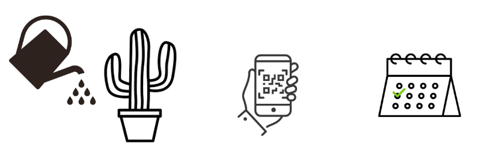
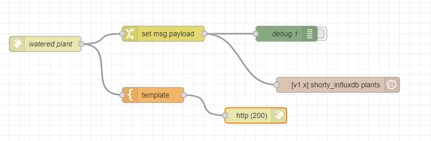
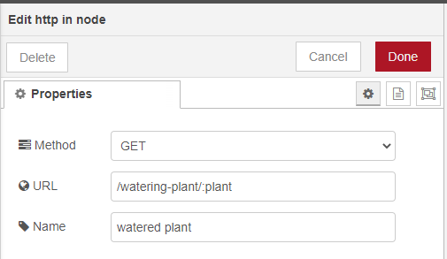
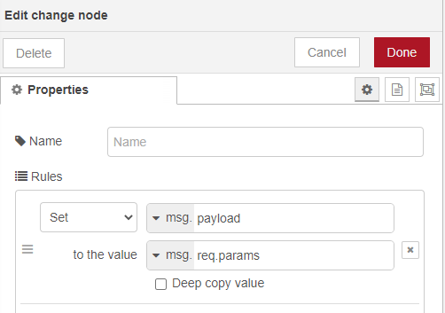
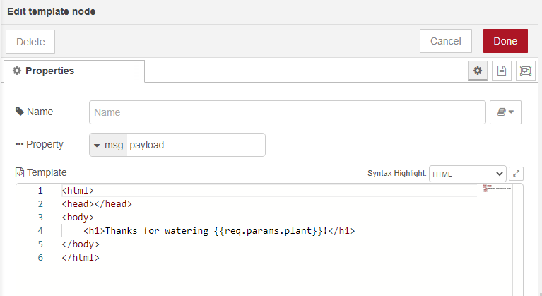
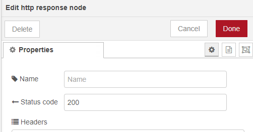
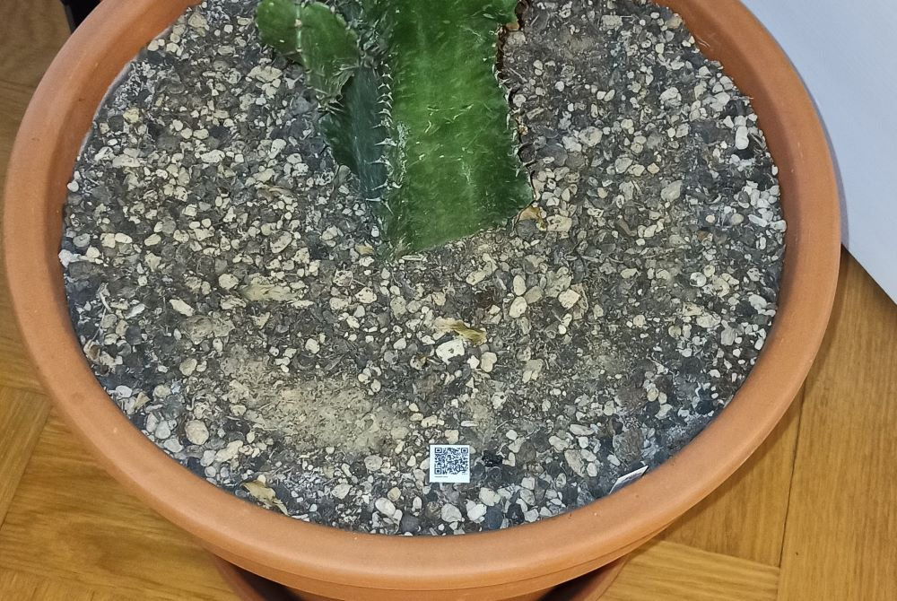
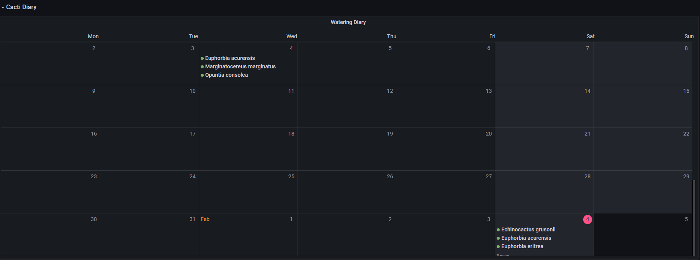

# Cacti Diary

Track when you've watered your cacti! 

Scanning a qr code will create and entry in influxdb, which then in turn can be displayed on a calendar in a grafana dashboard. 
That way, you can keep track when you've last watered your cacti or anything else really... 

This is an example of how to use qr codes to register events in influxdb and display them using grafana using node-red as the backbone. 

A similar approach using qr codes, node red and a database could be used to track inventory or create shopping lists of things you ran out off. 

## Pre requisits

- node-red
- influxdb
- grafana
- phone with qr code scanner and access to the network running node-red
- printer

# Step-by-Step example

## 1. Setup node-red http endpoints

You can use node-red to create http-get request and expose them as endpoints. When the http-get request is made, you can insert it into influxdb. 

http in node:

Configure the http in node as a GET request and define a URL. 
Note, the URL is relative to your node-red server and can include variables (here ":plant").
The full URL would then be: 

`` http://myServerIP:1880/watering-plant/Euphorbia%20eritrea ``

You can then extract the variable ":plant" and insert it into influxdb:

... and finally send back a reponse to the http-get request: 

Sources:

https://cookbook.nodered.org/http/handle-url-parameters

https://www.youtube.com/watch?v=EfcgUpOlQ-8

## 2. Create and print qr codes with your URL endpoints

You can use an online qr code generator to then create a URL for each cacti you wish to track: 
- ``http://192.168.1.110:1880/watering-plant/Pilosocereus%20magnificus``
- ``http://192.168.1.110:1880/watering-plant/Echinocactus%20grusonii``
- ``http://192.168.1.110:1880/watering-plant/Euphorbia%20acurensis``
- ``http://192.168.1.110:1880/watering-plant/Opuntia%20consolea``
- ``http://192.168.1.110:1880/watering-plant/Marginatocereus%20marginatus``
- `` http://192.168.1.110:1880/watering-plant/Euphorbia%20eritrea ``

Then print, laminate using clear tape and distribute it to the corresponding cactus.

I printed the qr codes 10x10 mm and layed them on top of the soil. You might have to adapt the size to work well with your phone camera. 

Sources: 

https://goqr.me/

## 3. Show diary in grafana

First, you'll need to install the calendar plugin from grafana.
Next, you'll need to configure a new panel to show your cacti watering events. 

Sources:

https://volkovlabs.io/

https://www.youtube.com/watch?v=iPJ122x0oos
